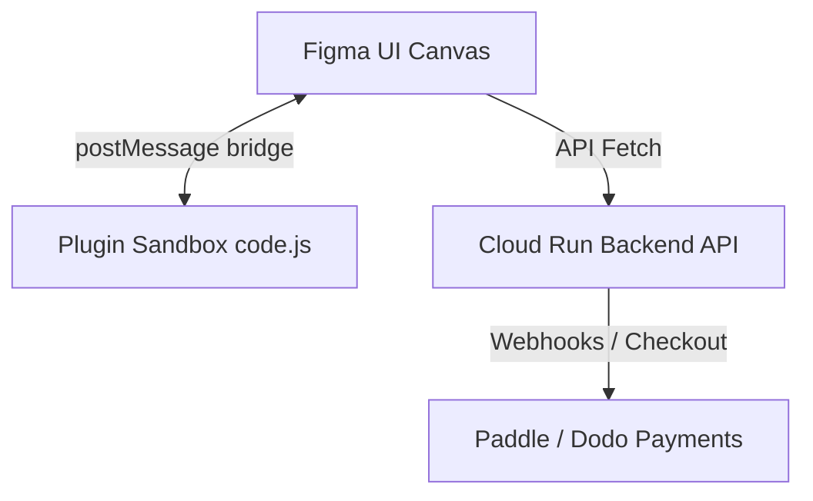

# RemoveBG Figma Plugin

RemoveBG is a premium Figma plugin that brings state-of-the-art background removal and AI-driven image editing capabilities directly to your Figma canvas. Powered by a high-performance backend, the plugin allows users to seamlessly clean, adjust, and generate visual assets without leaving their design workspace.

---

## 🚀 Features

The plugin provides 10 key tools across free and subscription tiers:

*   **Remove Background (Basic):** Quick and clean background extraction.
*   **Crop & Resize Image:** Smart padding and auto-centering of subjects.
*   **Color Background Fill:** Instantly replace backgrounds with solid colors.
*   **AI Background Generator:** Generate beautiful custom backgrounds via prompts.
*   **AI Shadows:** Apply soft or hard natural shadows with control over direction and spread.
*   **AI Relighting:** Re-light portrait and product images automatically or with custom themes.
*   **HD Export:** High-resolution asset generation (up to 36 megapixels).
*   **AI Upscale:** Enhance image resolution up to 4x (from source up to ~1000px).
*   **AI Image Generator:** Generate new images from text prompts directly inside Figma.
*   **AI Logo Maker:** Build modern vector-like logos via text descriptions.

---

## 🛠️ Architecture

The plugin is split into two primary environments complying with Figma's sandboxed environment:



1.  **Plugin Sandbox (`src-plugin`):** Handles viewport interactions, exporting canvas layers into image bytes, and inserting resulting layers back into Figma.
2.  **Plugin UI (`src-ui`):** A modern React + TypeScript single-page application built using Vite. It manages state via Redux Toolkit (RTK), handles checking user subscription statuses, and communicates with the backend API.

---

## 📦 Tech Stack

*   **Core Logic:** TypeScript
*   **UI Framework:** React 18
*   **State Management:** Redux Toolkit (RTK)
*   **Build Tooling:** Vite & SingleFile plugin (inlines assets into a single HTML file for Figma)
*   **Styling:** Custom Vanilla CSS (fluid layouts, dark-mode styling, glassmorphism)

---

## 💻 Setup & Development

### Prerequisites

Ensure you have Node.js (version 18 or later) installed.

### 1. Install Dependencies
Run the following command in the workspace directory:
```bash
npm install
```

### 2. Run in Development Mode
To watch UI and Plugin files for changes:
```bash
npm run dev
```
*   `npm run watch:ui` builds the frontend React bundle on changes.
*   `npm run watch:plugin` compiles the TypeScript sandbox plugin code on changes.

### 3. Build for Production
To generate inlined production builds ready for Figma distribution:
```bash
npm run build
```
The output files will be created in the `dist/` directory:
*   `dist/code.js` — The main plugin sandbox script.
*   `dist/ui.html` — The single inlined HTML bundle containing all styles, assets, and React code.

---

## 🔌 Load the Plugin in Figma

1.  Open the **Figma Desktop App**.
2.  Open a design file.
3.  Go to the **Figma Menu** -> **Plugins** -> **Development** -> **New Plugin...**
4.  Click **Link existing manifest** and select the [manifest.json](manifest.json) file in this directory.
5.  Right-click on the canvas, go to **Plugins** -> **Development** -> **RemoveBG** to run it.
